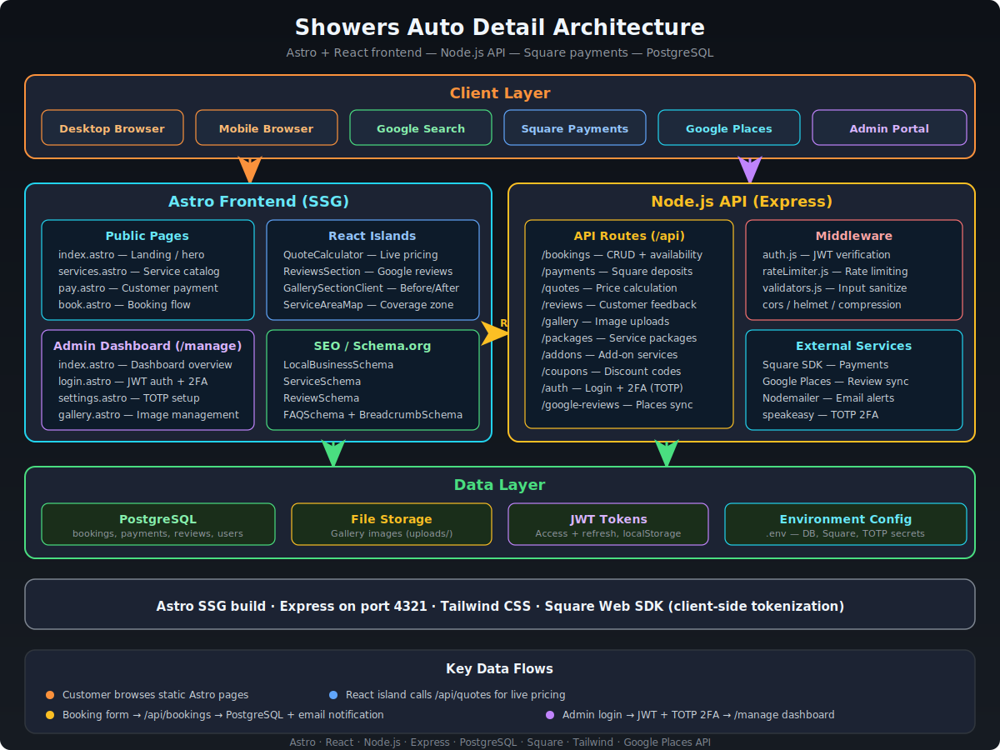

# Showers Auto Detail Website

A mobile-first auto detailing booking platform. Customers can get instant quotes, book services, and pay deposits online. Business owners get an admin dashboard with booking management, payment tracking, and notification systems.

**Live site**: https://showersautodetail.com

## Architecture



## Features

- Instant quote calculator with two-question flow
- Online booking with calendar selection
- Before/after gallery with interactive drag sliders
- Square payment integration for deposits and final payments
- Customer review system with star ratings
- Service area map showing coverage zone
- Email and SMS notifications (new bookings, quotes, payments)
- Admin dashboard with 2FA authentication

## Tech Stack

**Frontend**: Astro 5.0 + React 19 + Tailwind CSS 4
**Backend**: Node.js + Express + PostgreSQL
**Payments**: Square
**Notifications**: Brevo (email), Telnyx (SMS)
**Maps**: Google Maps API
**Deployment**: Docker Compose

## Getting Started

You'll need Docker, Docker Compose, and Git installed on your machine.

### Clone and Setup

```bash
git clone https://github.com/yourusername/showersautodetail.git
cd showersautodetail
chmod +x setup.sh
./setup.sh
```

The setup script checks your dependencies, creates a `.env` file from the template, installs npm packages, and starts the Docker containers.

### Configure Your Environment

Open `.env` and fill in your values:

```bash
nano .env
```

**Required**:
- `JWT_SECRET` - Generate with `openssl rand -hex 32`
- `POSTGRES_PASSWORD` - Pick something strong

**Payments** (get credentials from [Square Developer Dashboard](https://developer.squareup.com/docs)):
- `SQUARE_APPLICATION_ID`
- `SQUARE_ACCESS_TOKEN`
- `SQUARE_LOCATION_ID`

**Email** (get API key from [Brevo](https://developers.brevo.com/)):
- `BREVO_API_KEY`
- `NOTIFICATION_EMAIL_FROM`
- `NOTIFICATION_EMAIL_TO`

**SMS** (optional, get credentials from [Telnyx](https://developers.telnyx.com/docs)):
- `TELNYX_API_KEY`
- `TELNYX_PHONE_NUMBER`

**Maps** (get key from [Google Cloud Console](https://developers.google.com/maps/documentation)):
- `GOOGLE_MAPS_API_KEY`
- `SERVICE_AREA_LAT`, `SERVICE_AREA_LNG`, `SERVICE_AREA_RADIUS`

### Start the Application

```bash
docker-compose up -d
```

Check that everything's running:
- Frontend: http://localhost:4321
- Backend API: http://localhost:3000
- Health check: http://localhost:3000/health

### Create an Admin Account

```bash
curl -X POST http://localhost:3000/api/auth/setup \
  -H "Content-Type: application/json" \
  -d '{"email": "you@example.com", "password": "your_password", "name": "Your Name"}'
```

Access the admin dashboard at http://localhost:4321/manage/

## Development

Run the frontend and backend separately for development with hot reload:

```bash
# Terminal 1 - Frontend
npm run dev

# Terminal 2 - Backend
cd backend && npm run dev
```

Build for production:
```bash
npm run build
npm run preview
```

## Deployment

This section walks you through deploying on a VPS (Ubuntu/Debian).

### 1. Server Requirements

- Ubuntu 22.04 or Debian 12
- 1GB RAM minimum (2GB recommended)
- 20GB storage
- A domain pointed to your server's IP

### 2. Install Docker

```bash
# Update packages
sudo apt update && sudo apt upgrade -y

# Install Docker
curl -fsSL https://get.docker.com | sh
sudo usermod -aG docker $USER

# Log out and back in, then verify
docker --version
docker compose version
```

### 3. Clone and Configure

```bash
git clone https://github.com/yourusername/showersautodetail.git
cd showersautodetail
cp .env.example .env
nano .env
```

Set `NODE_ENV=production` and update all the API keys and credentials.

### 4. Start the Application

```bash
docker compose up -d --build
```

The containers restart automatically if the server reboots (configured in docker-compose.yml).

### 5. Set Up Nginx as Reverse Proxy

```bash
sudo apt install nginx -y
```

Create a site config:

```bash
sudo nano /etc/nginx/sites-available/showersautodetail
```

```nginx
server {
    listen 80;
    server_name yourdomain.com www.yourdomain.com;

    location / {
        proxy_pass http://127.0.0.1:4321;
        proxy_http_version 1.1;
        proxy_set_header Upgrade $http_upgrade;
        proxy_set_header Connection 'upgrade';
        proxy_set_header Host $host;
        proxy_set_header X-Real-IP $remote_addr;
        proxy_set_header X-Forwarded-For $proxy_add_x_forwarded_for;
        proxy_set_header X-Forwarded-Proto $scheme;
        proxy_cache_bypass $http_upgrade;
    }

    location /api {
        proxy_pass http://127.0.0.1:3000;
        proxy_http_version 1.1;
        proxy_set_header Host $host;
        proxy_set_header X-Real-IP $remote_addr;
        proxy_set_header X-Forwarded-For $proxy_add_x_forwarded_for;
        proxy_set_header X-Forwarded-Proto $scheme;
    }

    location /health {
        proxy_pass http://127.0.0.1:3000;
    }
}
```

Enable the site:

```bash
sudo ln -s /etc/nginx/sites-available/showersautodetail /etc/nginx/sites-enabled/
sudo nginx -t
sudo systemctl reload nginx
```

### 6. Add SSL with Let's Encrypt

```bash
sudo apt install certbot python3-certbot-nginx -y
sudo certbot --nginx -d yourdomain.com -d www.yourdomain.com
```

Certbot sets up automatic renewal. Test it with:

```bash
sudo certbot renew --dry-run
```

### 7. Firewall

```bash
sudo ufw allow 22
sudo ufw allow 80
sudo ufw allow 443
sudo ufw enable
```

### Useful Commands

```bash
# View logs
docker compose logs -f

# Restart services
docker compose restart

# Stop everything
docker compose down

# Update and redeploy
git pull
docker compose up -d --build
```

## Project Structure

```
showersautodetail/
├── backend/
│   ├── config/           # Database connection
│   ├── middleware/       # Auth, rate limiting, validators, notifications
│   ├── routes/           # API endpoints
│   ├── schema.sql        # Database schema
│   └── server.js         # Express entry point
├── src/
│   ├── components/       # React and Astro components
│   ├── layouts/          # Page layouts
│   ├── pages/            # Astro pages
│   └── styles/           # Global styles
├── public/               # Static assets
├── .env.example          # Environment template
├── docker-compose.yml    # Container orchestration
├── Dockerfile.backend    # Backend container
├── Dockerfile.frontend   # Frontend container
└── setup.sh              # Setup script
```

## API Endpoints

**Authentication** (`/api/auth`)
- POST `/login` - Admin login (supports 2FA)
- POST `/refresh` - Refresh access token
- POST `/logout` - Revoke refresh token
- GET `/me` - Current user info
- POST/GET `/2fa/*` - Two-factor authentication management

**Quotes** (`/api/quotes`)
- POST `/` - Submit quote request (public, rate limited)
- GET `/` - List all quotes (admin)
- PATCH `/:id/status` - Update quote status (admin)

**Bookings** (`/api/bookings`)
- POST `/` - Create booking (public, rate limited)
- GET `/` - List all bookings (admin)
- GET `/:id` - Booking details (admin)
- PATCH `/:id/status` - Update status (admin)
- GET `/customer/:email` - Customer's bookings
- POST `/:id/cancel` - Cancel booking

**Reviews** (`/api/reviews`)
- GET `/` - Approved reviews (public)
- POST `/` - Submit review (pending approval)
- GET `/stats` - Review statistics

**Gallery** (`/api/gallery`)
- GET `/` - All gallery photos
- GET `/featured` - Featured photos only

**Packages** (`/api/packages`)
- GET `/` - Active service packages
- GET `/:id` - Package details
- POST `/calculate-price` - Price calculation

**Add-ons** (`/api/addons`)
- GET `/` - All active add-ons
- GET `/services/all` - Services with pricing
- POST `/calculate` - Add-on price calculation

**Payments** (`/api/payments`)
- POST `/create-deposit-payment` - Create deposit
- POST `/create-final-payment` - Create final payment
- POST `/webhook` - Square webhook handler

**Coupons** (`/api/coupons`)
- GET/POST `/` - List/create coupons (admin)
- PATCH `/:id/toggle` - Toggle coupon (admin)
- DELETE `/:id` - Delete coupon (admin)
- POST `/validate` - Validate coupon code

## Admin Dashboard

Access at `/manage/` after logging in. Features:

- Quote request queue with status tracking
- Booking calendar and management
- Payment status monitoring
- Review approval workflow
- Gallery photo management
- Coupon code creation
- Two-factor authentication setup

## License

Proprietary software. All rights reserved.
